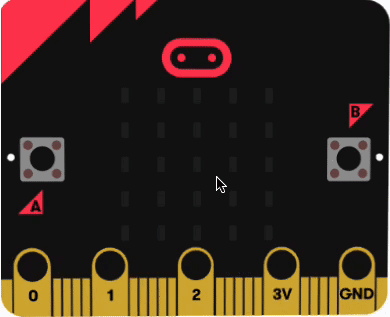

## Track and display

### Opening MakeCode

To get started creating your micro:bit project, you will need to open the MakeCode editor.

--- task ---

Open the MakeCode editor at [makecode.microbit.org](https://makecode.microbit.org){:target="_blank"}

--- collapse ---

---
title: Offline version of the editor
---

There is also a [downloadable version of the MakeCode editor](https://makecode.microbit.org/offline-app){:target="_blank"}.

--- /collapse ---

--- /task ---

Once the editor is open, you will need to create a New Project and give your project a name. 

--- task ---

Click on the **New Project** button.

--- /task ---

--- task ---

Give your new project the name `Sleep tracker` and click **Create**.

**Tip:** Give your project a helpful name that relates to the activity you’re creating. This will make it easier to find if you create other projects on MakeCode.

--- /task ---

[[[makecode-tour]]]

In this step you will program the micro:bit to sense if it moves and make the LEDs light if it does.

The micro:bit uses a sensor called an accelerometer to sense when it has been rolled.

Accelerometers are used in many devices. They can tell if we're moving, like when we run or jump, and they help our tablets and smartphones know which way they're being held. These clever sensors make games more fun, letting you control how a character moves by tilting a controller. So next time you play a game, remember that accelerometers are making it super cool!

### Roll

We need to check **if** the micro:bit has been rolled right **or** left. 

If this happens, we will assume there has been movement during sleep.

--- task ---

From the <code style="background-color: #00A4A6">Logic</code> menu, drag out an <code style="background-color: #00A4A6">if</code> block and place it inside the <code style="background-color: #1E90FF">forever</code> block.

--- /task ---

--- task ---

Open the <code style="background-color: #00a4a6">Logic</code> menu again and take an <code style="background-color: #00a4a6">or</code> block. 

Place it in the `true` section of the <code style="background-color: #00a4a6">if</code> block. 

<iframe style="position:relative;top:0;left:0;width:75%;height:75%;" src="https://makecode.microbit.org/---codeembed#pub:_d6KcohD3RCjK" allowfullscreen="allowfullscreen" frameborder="0" sandbox="allow-scripts allow-same-origin"></iframe>

--- /task ---

Now you need to add the **two** conditions either side of the **or**. 

This will mean that the code inside your <code style="background-color: #00a4a6">if</code> block will run **either** condition is met.

--- task ---

From the <code style="background-color: #00A4A6">Logic</code> menu, drag out the <code style="background-color: #00a4a6">0 < 0</code> comparison block.

Place it on the left side of the <code style="background-color: #00a4a6">or</code> block.

<iframe style="position:relative;top:0;left:0;width:75%;height:75%;" src="https://makecode.microbit.org/---codeembed#pub:_6zUfDw2k274E" allowfullscreen="allowfullscreen" frameborder="0" sandbox="allow-scripts allow-same-origin"></iframe>

--- /task ---

--- task ---

From the <code style="background-color: #D400D4">Input ... more</code> menu, drag out a <code style="background-color: #D400D4">rotation</code> block.

Place it inside the first `0` in the <code style="background-color: #00a4a6">0 < 0</code> comparison block.

Use the dropdown to change <code style="background-color: #D400D4">pitch</code> to <code style="background-color: #D400D4">roll</code>. 

Change the `0` to `-10`.

--- /task ---

**Debug** Check you have:
+ Clicked on the Input **more** menu, not the normal Input menu.
+ Changed the second value from `0` to **`-10`**, not `10`.

--- task ---

Right click on the <code style="background-color: #00a4a6">0 < 0</code> comparison block and select Duplicate.

You will now have two comparison blocks.

Drag the duplicated comparison block to the right of the <code style="background-color: #00a4a6">or</code> block.

Use the dropdown to change the less than symbol (`<`) to a greater than symbol (`>`). 

Change the `-10` to `10`.

<iframe style="position:relative;top:0;left:0;width:100%;height:100%;" src="https://makecode.microbit.org/---codeembed#pub:_2jaW263vc1mt" allowfullscreen="allowfullscreen" frameborder="0" sandbox="allow-scripts allow-same-origin"></iframe>

--- /task ---

When either condition is met, the micro:bit will have been rolled left or right.

We need to:
+ Keep a count of sleep movements
+ Light the LEDs

To keep a count of sleep movements, we will use a variable.

--- task ---

Open the <code style="background-color: #dc143c">Variables</code> menu and click `Make a Variable`.

--- /task ---

--- task ---

Name your new variable `movements`. 

--- /task ---

We will increase the movements variable by `1` each time a movement is detected.

--- task ---

From the <code style="background-color: #dc143c">Variables</code> menu, grab the <code style="background-color: #dc143c">change movements</code> block. 

Place it inside the <code style="background-color: #00A4A6">if</code> block.

<iframe style="position:relative;top:0;left:0;width:100%;height:100%;" src="https://makecode.microbit.org/---codeembed#pub:_iT2FmD3d7TE2" allowfullscreen="allowfullscreen" frameborder="0" sandbox="allow-scripts allow-same-origin"></iframe>

--- /task ---

You can use the LEDs on the micro:bit to show there has been a movement. 

This will help you test your project.

--- task ---

From the <code style="background-color: #1E90FF">Basic</code> menu, drag a <code style="background-color: #1E90FF">show icon</code> block.

Place it under the <code style="background-color: #dc143c">change movements</code> block.

From the <code style="background-color: #1E90FF">Basic</code> menu, drag a <code style="background-color: #1E90FF">pause</code> block.

Place it under the <code style="background-color: #1E90FF">show icon</code> block.

From the <code style="background-color: #1E90FF">Basic</code> menu, drag a <code style="background-color: #1E90FF">clear screen</code> block.

Place it under the <code style="background-color: #1E90FF">pause</code> block.

<iframe style="position:relative;top:0;left:0;width:100%;height:100%;" src="https://makecode.microbit.org/---codeembed#pub:_UL1DcWbiR5Ey" allowfullscreen="allowfullscreen" frameborder="0" sandbox="allow-scripts allow-same-origin"></iframe>

--- /task ---

When you make a change to a code block in the code editor panel, the simulator will restart.

--- task ---

**Test** your program:

+ Move over the right or left of the micro:bit. 

The LEDs will light up and show a heart icon.

+ Move away from the micro:bit 

The LEDs will continue to flash until the micro:bit is at a level position.

--- /task ---

### Dealing with different resting head positions

At the moment, the micro:bit is recording a movement whenever the micro:bit is **not** level.

For this project, the micro:bit will be placed under a pillow (as it would be uncomfortable to wear it on the head!)

When you lie down, the weight of your head on your pillow will probably roll the micro:bit so that it is not completely level.

This will be the **resting position**. 

We need to record a movement only if the micro:bit is rolled away from the resting position. 

In other words, we need to know if there is a difference between the resting position and the current roll position.

--- task ---

From the <code style="background-color: #9400D3">Math</code> menu, grab a <code style="background-color: #9400D3">0 - 0</code> block.

Place it in the `-10` of the <code style="background-color: #00A4A6"><</code> comparison block.

--- /task ---

--- task ---

Open the <code style="background-color: #dc143c">Variables</code> menu and click `Make a Variable`.

Name your new variable `restingPosition`.

From the <code style="background-color: #dc143c">Variables</code> menu, grab the <code style="background-color: #dc143c">restingPosition</code> block. 

Place it in the first `0` on the left of the <code style="background-color: #9400D3">0 - 0</code> block. 

Change the `0` to the right of the <code style="background-color: #9400D3">-</code> with `10`.

<iframe style="position:relative;top:0;left:0;width:100%;height:100%;" src="https://makecode.microbit.org/---codeembed#pub:_i6zFuRE2K8ew" allowfullscreen="allowfullscreen" frameborder="0" sandbox="allow-scripts allow-same-origin"></iframe>

--- /task ---

--- task ---

From the <code style="background-color: #9400D3">Math</code> menu, grab another <code style="background-color: #9400D3">0 - 0</code> block.

Place it in the `10` of the <code style="background-color: #00A4A6">></code> comparison block.

Change the <code style="background-color: #9400D3">-</code> to a <code style="background-color: #9400D3">+</code>

From the <code style="background-color: #dc143c">Variables</code> menu, grab another <code style="background-color: #dc143c">restingPosition</code> block. 

Place it in the first `0` on the left of the <code style="background-color: #9400D3">0 + 0</code> block.

Change the `0` to the right of the <code style="background-color: #9400D3">+</code> with `10`.

<iframe style="position:relative;top:0;left:0;width:100%;height:100%;" src="https://makecode.microbit.org/---codeembed#pub:_hmmgeHXfb5xH" allowfullscreen="allowfullscreen" frameborder="0" sandbox="allow-scripts allow-same-origin"></iframe>

--- /task ---

Each time the micro:bit is rolled to a new resting position, we need to set the new resting position, so we can use it in our comparison.

We will use a new variable to set the resting position.

--- task ---

From the <code style="background-color: #dc143c">Variables</code> menu, grab the <code style="background-color: #dc143c">set</code> block. 

Place it under the <code style="background-color: #1E90FF">pause</code> block.

Duplicate the <code style="background-color: #D400D4">rotation</code> block and place it in the `0` of the <code style="background-color: #DC143C">set</code> block.

<iframe style="position:relative;top:0;left:0;width:100%;height:100%;" src="https://makecode.microbit.org/---codeembed#pub:_VooFR6cseED5" allowfullscreen="allowfullscreen" frameborder="0" sandbox="allow-scripts allow-same-origin"></iframe>

--- /task ---

When you make a change to a code block in the code editor panel, the simulator will restart.

**Test** your program:
+ Move from the centre of the micro:bit to the right or left. 

The LEDs will light up and stay on for a short time. 
***Keep your mouse still.***

+ When the LEDs turn off, move from the new position (your resting position) to the right or left again. 

The LEDs will light up and stay on for a short time.

Repeat this process to see how the LEDs will turn on only when there is movement away from the resting position.

### Letting the micro:bit come to rest

Change the value in <code style="background-color: #1E90FF">pause</code> from `100` to `5 seconds`.

This gives enough time for the micro:bit to come to rest before storing the new <code style="background-color: #DC143C">restingPosition</code> to the variable.

<iframe style="position:relative;top:0;left:0;width:100%;height:100%;" src="https://makecode.microbit.org/---codeembed#pub:_Aqgc2mHrw529" allowfullscreen="allowfullscreen" frameborder="0" sandbox="allow-scripts allow-same-origin"></iframe>

Next you are going to use the `A+B` button press event to reset your sleep tracker!