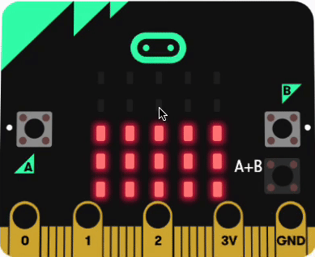

## Push to reset

In this step it's time to make your sleep tracker even better! 

When you press both the A and B buttons together, the micro:bit will show how much it moved and then start counting from zero again. 

You'll also make a special sleepy animation to know your sleep tracker is all set and ready to help you sleep!

The micro:bit has two buttons, the `A` button and the `B` button. 

You can program something to happen when only `A` is pressed, only `B` is pressed, or `A+B` are pressed together.

### Show the total movements

--- task ---

From the <code style="background-color: #D400D4">Input</code> menu, drag out an <code style="background-color: #D400D4">on button</code> block and place it on the code editor panel.

Use the dropdown to change the button to <code style="background-color: #d400d4">A+B</code>.

--- /task ---

Before the micro:bit displays the total number of recorded sleep movements, you will need to clear the screen. 

--- task ---

From the <code style="background-color: #1E90FF">Basic</code>menu, drag out a <code style="background-color: #1E90FF">clear screen</code> block and place it inside the <code style="background-color: #d400d4">on button</code> block.  

The clear screen block turns off all the LEDs.

--- /task ---

Next, you will want to see the total number of sleep movements the micro:bit has recorded.

Before you display the number, it is a good idea to show what the number is.

--- task ---

From the <code style="background-color: #1E90FF">Basic</code>menu, drag out a <code style="background-color: #1E90FF">show string</code> block and place it inside the <code style="background-color: #d400d4">on button</code> block under the <code style="background-color: #d400d4">clear screen</code> block and replace the word `Hello` with `Movements`.

--- /task ---

Now it is time to display the total number of sleep movements recorded.

--- task ---

From the <code style="background-color: #1E90FF">Basic</code>menu, drag out a <code style="background-color: #1E90FF">show number</code> block and place it inside the <code style="background-color: #d400d4">on button</code> block under the <code style="background-color: #d400d4">show string</code> block. 

--- /task ---

--- task ---

From the <code style="background-color: #DC143C">Variables</code> menu, drag out the <code style="background-color: #DC143C">movements</code> block and place it over the `0` in the <code style="background-color: #d400d4">show number</code> block.

<iframe style="position:relative;top:0;left:0;width:75%;height:75%;" src="https://makecode.microbit.org/---codeembed#pub:_bh7Lw76vDhJx" allowfullscreen="allowfullscreen" frameborder="0" sandbox="allow-scripts allow-same-origin"></iframe>

--- /task ---

We now need to reset the movements variable back to 0, ready to track again.

--- task ---

From the <code style="background-color: #DC143C">Variables</code> menu, drag out the <code style="background-color: #DC143C">set movements</code> block and place it under the <code style="background-color: #d400d4">show number</code> block.

<iframe style="position:relative;top:0;left:0;width:100%;height:100%;" src="https://makecode.microbit.org/---codeembed#pub:_eHpTW3Xy0Jpt" allowfullscreen="allowfullscreen" frameborder="0" sandbox="allow-scripts allow-same-origin"></iframe>

--- /task ---

To show the sleep tracker is ready, you can show an animation. As this is a sleep tracker, we will create an animation of some Zs.

--- task ---

From the <code style="background-color: #1E90FF">Basic</code>menu, drag out `three` <code style="background-color: #1E90FF">show leds</code> blocks and place them under the <code style="background-color: #DC143C">set movements</code> block.

Click the squares on each one to create these patterns:

<iframe style="position:relative;top:0;left:0;width:100%;height:100%;" src="https://makecode.microbit.org/---codeembed#pub:_AaDf7mJwE52H" allowfullscreen="allowfullscreen" frameborder="0" sandbox="allow-scripts allow-same-origin"></iframe>

**Tip** If you hold down the mouse, you can select multiple LEDs as you move.

--- /task ---

To create an animation, you can put the show LED blocks in a loop.

--- task ---

From the <code style="background-color: #00AA00">Loops</code> menu, drag a <code style="background-color: #00AA00">repeat</code> block and place it around the three <code style="background-color: #1E90FF">show leds</code> blocks.

Change the number of repeats from `4` to `2`.

--- /task ---

When you make a change to a code block in the code editor panel, the simulator will restart.

**Test** 
When the program runs, move over the left and right of the micro:bit to record some movements. 

Next, press the `A+B` button. 

The word 'Movements' will scroll across the display and the number of movements will be shown. The zZ animation will then loop twice.

Next you are going to use the `A` button and `B` button to change the display brightness!