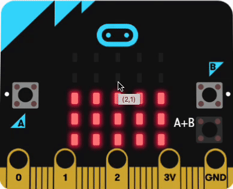

## Change brightness

When it is late at night, the LEDs on your micro:bit might be too bright.

In this step, you will use the A button and B button to change the brightness of the micro:bit's LED display.

To sleep better, try not to be around really bright light 2 hours before bedtime. If you can't sleep, make the lights less bright 2 hours before you want to sleep. And if you feel too sleepy early, go where the lights are bright to feel more awake.

Because the A button is on the left, we will use it to turn the brightness down.

### Brightness down

--- task ---

From the <code style="background-color: #D400D4">Input</code> menu, drag out an <code style="background-color: #D400D4">on button</code> block and place it on the code editor panel.

--- /task ---

Each time the A button is pressed, we will halve the brightness.

--- task ---

From the <code style="background-color: #5C2D91">Led ... more</code> menu, drag out a <code style="background-color: #5C2D91">set brightness</code> block and place it inside the <code style="background-color: #D400D4">on button</code> block.

**Debug** Check you have clicked on the Led **more** menu, not the normal Led menu.

--- /task ---

To halve the brightness, we will use a Math block.

--- task ---

From the <code style="background-color: #9400D3">Math</code> menu, drag out a <code style="background-color: #9400D3">0 / 0</code> divide block and place it over the `255` value in the <code style="background-color: #5C2D91">set brightness</code> block.

From the <code style="background-color: #5C2D91">Led ... more</code> menu, drag out a <code style="background-color: #5C2D91">brightness</code> block and place it over the first `0` value in the <code style="background-color: #9400D3">0 / 0</code> block.

Change the second `0` to a `2`.

This will set the brightness to whatever value it currently is, divided by 2.

<iframe style="position:relative;top:0;left:0;width:50%;height:50%;" src="https://makecode.microbit.org/---codeembed#pub:_R06gicKH4Kt2" allowfullscreen="allowfullscreen" frameborder="0" sandbox="allow-scripts allow-same-origin"></iframe>

--- /task ---

### Brightness up

Now we will set up the B button to turn the brightness up.

--- task ---

Right-click on the entire <code style="background-color: #D400D4">on button A</code> block and click `Duplicate`.

There will now be two <code style="background-color: #D400D4">on button A</code> blocks on the code editor panel.

--- /task ---

--- task ---

Click on the arrow next to <code style="background-color: #D400D4">A</code> on the duplicated block. 

A drop down menu will open.

Choose <code style="background-color: #D400D4">B</code>.

--- /task ---

--- task ---

Click on the arrow next to <code style="background-color: #9400D3">/</code> on the duplicated block. 

A drop down menu will open.

Choose <code style="background-color: #9400D3">×</code>.

You will now have these blocks for the A button and the B button:

<iframe style="position:relative;top:0;left:0;width:75%;height:75%;" src="https://makecode.microbit.org/---codeembed#pub:_7VtHDq1F0884" allowfullscreen="allowfullscreen" frameborder="0" sandbox="allow-scripts allow-same-origin"></iframe>

--- /task ---

When you make a change to a code block in the code editor panel, the simulator will restart.

**Test** your program: 
+ Click the `A` button until the LEDs go out fully. 

+ Click the `B` button and see what happens.

If you have pressed the `A` button enough times, pressing the `B` button will not turn the LEDs back on.

This is because the brightness value has reached `0`.

When you multiply `0` by `2` you get.... `0`. You can press the `B` button as many times as you want, but you will keep setting the brightness to `0 × 2`, which is **always** `0`!

So, we need to stop the brightness value from being set to `0`.

To do this, we will use a Logic block to only halve the brightness value **if** the brightness level is **more than 10**.

--- task ---

From the <code style="background-color: #00A4A6">Logic</code> menu, drag out a <code style="background-color: #00A4A6">if</code> block and place it around the <code style="background-color: #5C2D91">set brightness</code> block in the <code style="background-color: #D400D4">on button A</code> block.

--- /task ---

--- task ---

From the <code style="background-color: #00A4A6">Logic</code> menu, drag out a <code style="background-color: #00A4A6">0 < 0</code> block and place it over the <code style="background-color: #00A4A6">true</code> part.

Change the <code style="background-color: #00A4A6"><</code> to a <code style="background-color: #00A4A6">></code>

--- /task ---

--- task ---

From the <code style="background-color: #5C2D91">Led ... more</code> menu, drag out a <code style="background-color: #5C2D91">brightness</code> block and place it inside the first `0` in the <code style="background-color: #00A4A6">0 > 0</code> block.

Change the second `0` to `10`.

<iframe style="position:relative;top:0;left:0;width:75%;height:75%;" src="https://makecode.microbit.org/---codeembed#pub:_8RWA44daDH1K" allowfullscreen="allowfullscreen" frameborder="0" sandbox="allow-scripts allow-same-origin"></iframe>

--- /task ---

**Tip** There is no need to do this for the `on button B` block as the maximum value the LEDs can be set to is `255`.

When you make a change to a code block in the code editor panel, the simulator will restart.

--- task ---

**Test** your program: 

+ Move over the left and right of the micro:bit to record and display some movements. 

+ Press the `A` button a few times. 

The display should get less bright.

+ Press the `B` button a few times. 

The display should get brighter.

--- /task ---

Next you are going to set the sleepy zZ animation to run when the program starts and organise your code using a function!