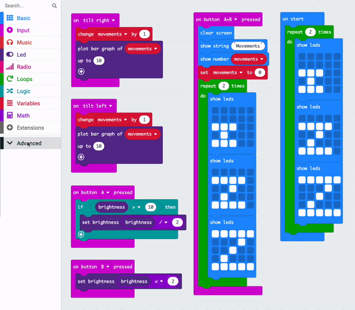

## Show some Zs

When the program starts, it is good to know that it is ready to start tracking.

In this step, you will display the zZs animation again when the program starts and use a function to organise your code.

### Re-using code

We have not yet put any code to run in the <code style="background-color: #1E90FF">on start</code> block.

We can copy the animation code there, re-using it.

--- task ---

Right-click on the <code style="background-color: #00AA00">repeat</code> block and click `Duplicate`.

--- /task ---

There will now be two <code style="background-color: #00AA00">repeat</code> blocks on the code editor panel. Each will contain three <code style="background-color: #1E90FF">show led</code> blocks

--- task ---

Drag the duplicated <code style="background-color: #00AA00">repeat</code> block and put it inside the <code style="background-color: #1E90FF">on start</code> block.

--- /task ---

### Tidy with a function

The animation is a large group of code blocks. 

Repeating it makes our code untidy.

We may want to re-use this animation code again.

If you need to re-use code, it is sometimes better to put it in a function and then 'call' the function to run. 

--- task ---

Click the `Advanced` menu to reveal the Functions menu.

Click the Functions menu and then click `Make a Function`.

Name the function `zZ`.

--- /task ---

--- task ---

From the <code style="background-color: #D400D4">on button A+B</code> block, drag the <code style="background-color: #00AA00">repeat</code> block out and place it inside your new `zZ` function block.

Delete the code inside the <code style="background-color: #1E90FF">on start</code> block.

From the Advanced > Functions menu, drag out a 'call zZ' block and place it inside the <code style="background-color: #1E90FF"> on start</code> block.

Drag out another 'call zZ' block and place it inside the <code style="background-color: #D400D4">on button A+B</code> block, under the <code style="background-color: #DC143C">set movements</code> block.

--- /task ---

Now, when a `call zZ` block is executed, it calls the code in the `zZ function` to run.

Your code should look like this:

<iframe style="position:relative;top:0;left:0;width:125%;height:125%;" src="https://makecode.microbit.org/---codeembed#pub:_25fh4yKf3eMe" allowfullscreen="allowfullscreen" frameborder="0" sandbox="allow-scripts allow-same-origin"></iframe>

--- task ---

**Test** your program: 

+ Check that your zZ animation plays when the simulator starts
+ Check that your zZ animation also plays when the `A+B` button is pressed

--- /task ---

--- task ---

[[[download-to-microbit]]]

--- /task ---
