## Suivre et afficher

### Ouvrir MakeCode

Pour commencer à créer ton projet micro:bit, tu dois ouvrir l'éditeur MakeCode.

--- task ---

Ouvre l'éditeur MakeCode sur [makecode.microbit.org](https://makecode.microbit.org){:target="_blank"}

--- collapse ---

---
title: Version hors ligne de l'éditeur
---

Il y a aussi une version [téléchargeable de l'éditeur MakeCode](https://makecode.microbit.org/offline-app){:target="_blank"}.

--- /collapse ---

--- /task ---

### Premier projet sur micro:bit ?

[[[makecode-tour]]]

### Créer ton projet

Une fois que l'éditeur est ouvert, tu devras créer un nouveau projet et donner un nom à ton projet.

--- task ---

Clique sur le bouton **Nouveau projet**.

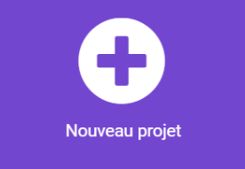

--- /task ---

--- task ---

Nomme-le `Suivi du sommeil` et clique sur **Créer**.

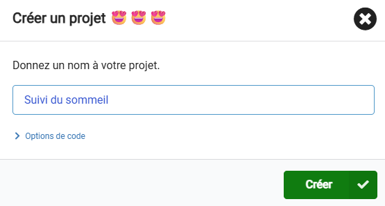

**Astuce :** pour faciliter la recherche de ton projet plus tard, donne-lui un nom utile qui se rapporte à l'activité que tu crées.

--- /task ---

<div style="display: flex; flex-wrap: wrap">
<div style="flex-basis: 200px; flex-grow: 1; margin-right: 15px;">
Dans cette étape, tu programmeras le micro:bit pour qu'il détecte s'il se déplace et allume les LED s'il le fait.
</div>
<div>

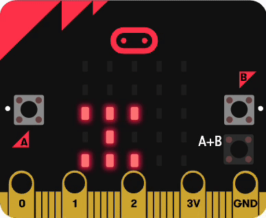

</div>
</div>

Le micro:bit utilise un capteur appelé accéléromètre pour déterminer s'il est incliné.

<p style="border-left: solid; border-width:10px; border-color: #0faeb0; background-color: aliceblue; padding: 10px;">

<span style="color: #0faeb0">Les accéléromètres</span> sont utilisés dans de nombreux appareils. Ils peuvent savoir si nous bougeons, comme lorsque nous courons ou sautons, et ils aident nos tablettes et nos smartphones à savoir dans quel sens ils sont tenus. Ces capteurs intelligents rendent les jeux plus amusants, te permettant de contrôler la façon dont un personnage se déplace en inclinant une manette.

</p>

### Rotation

Tu dois voir **si** le micro:bit a été tourné vers la droite **ou** vers la gauche.

Si cela se produit, tu supposeras qu’il y a eu du mouvement pendant le sommeil.

--- task ---

Dans le menu `Logique`{:class='microbitlogic'}, fais glisser un bloc `si`{:class='microbitlogic'} et place-le à l'intérieur du bloc `toujours`{:class='microbitbasic'}.

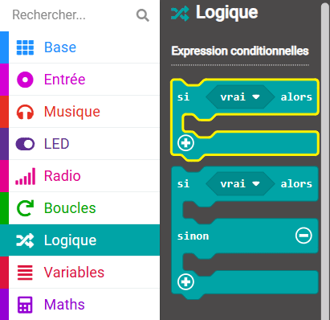

--- /task ---

--- task ---

Ouvre à nouveau le menu `Logique`{:class='microbitlogic'} et prends un bloc `ou`{:class='microbitlogic'}.

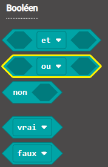

Place-le dans la section `vrai` du bloc `si`{:class='microbitlogic'}.

```microbit
basic.forever(function () {
    if (false || false) {

    }
})
```

--- /task ---

Tu dois maintenant ajouter les **deux** conditions de chaque côté du **ou**.

Cela signifie que le code contenu dans ton bloc `si`{:class="microbitlogic"} sera exécuté si **l'une ou l'autre** condition est remplie.

--- task ---

Dans le menu `Logique`{:class='microbitlogic'}, fais glisser le bloc de comparaison `0 < 0`{:class='microbitlogic'}.

Place-le sur le côté gauche du bloc `ou`{:class='microbitlogic'}.

```microbit
basic.forever(function () {
    if (0 < 0 || false) {

    }
})
```

--- /task ---

--- task ---

Dans le menu `Entrée...plus`{:class='microbitinput'}, fais glisser un bloc `rotation`{:class='microbitinput'}.

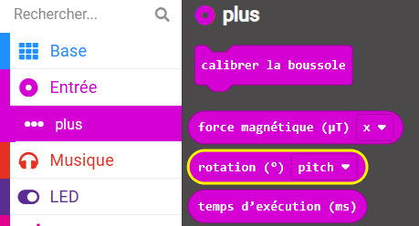

Place-le à l'intérieur du premier bloc de comparaison `0` dans le `0 < 0`{:class='microbitlogic'}.

--- /task ---

--- task ---

Utilise le menu déroulant pour modifier `pitch`{:class='microbitinput'} par `rouleau`{:class='microbitinput'}.

--- /task ---

--- task ---

Remplace le `0` par `-10`. Cela vérifiera si le micro:bit est tourné de 10° vers la **gauche**.

--- /task ---

Ton code devrait ressembler à ceci :

```microbit
basic.forever(function () {
    if (input.rotation(Rotation.Roll) < -10 || false) {

    }
})
```

--- task ---

**Déboguer**

Vérifie que tu as :

+ Cliqué sur le menu Entrée **plus**, pas dans le menu d'entrée normal
+ Modifié la deuxième valeur de `0` à **`-10`**, et non `10`

--- /task ---

--- task ---

Fais un clic droit sur le bloc de comparaison `<`{:class='microbitlogic'} et sélectionne **Reproduire**.

--- /task ---

Tu as maintenant deux blocs de comparaison.

--- task ---

Fais glisser le bloc de comparaison dupliqué à droite du bloc `ou`{:class='microbitlogic'}.

--- /task ---

--- task ---

Utilise le menu déroulant pour changer le symbole "plus petit que" (`<`{:class='microbitlogic'}) par "plus grand que" (`>`{:class='microbitlogic'}).

--- /task ---

--- task ---

Remplace le `-10` par `10`. Cela vérifiera si le micro:bit est tourné de 10° vers la **droite**.

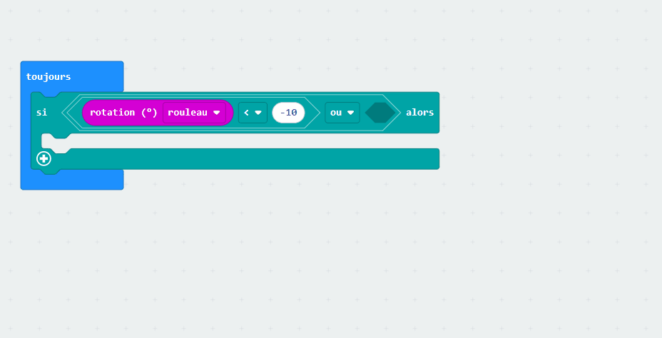

--- /task ---

### Garder un nombre

Lorsque l'une ou l'autre des conditions est remplie, le micro:bit aura été tourné vers la gauche ou vers la droite.

Tu dois :
+ Garder un nombre de mouvements de sommeil
+ Allumer les LED

Pour garder un nombre de mouvements de sommeil, tu utiliseras une variable.

--- task ---

Ouvre le menu `Variables`{:class='microbitvariables'} et clique sur **Créer une variable**.

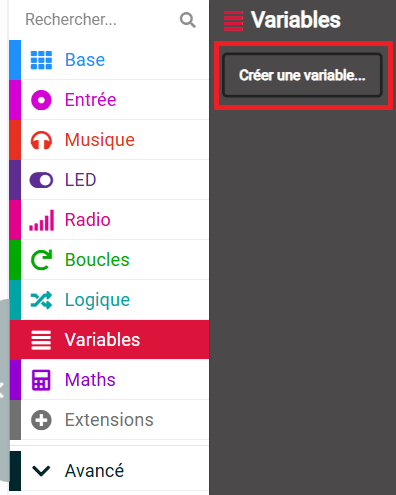

--- /task ---

--- task ---

Nomme ta nouvelle variable `mouvements`.

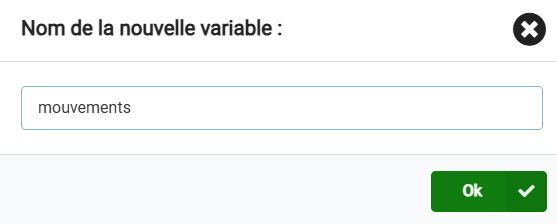

--- /task ---

Tu augmenteras la variable `mouvements` de `1` chaque fois qu'un mouvement est détecté.

--- task ---

Dans le menu `Variables`{:class='microbitvariables'}, prends le bloc `modifier mouvements`{:class='microbitvariables'}.

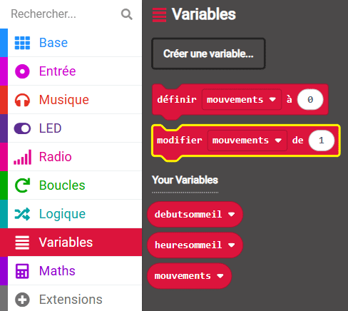

--- /task ---

--- task ---

Place-le à l'intérieur du bloc `si`{:class='microbitlogic'}.

```microbit
let mouvements = 0
basic.forever(function () {
    if (input.rotation(Rotation.Roll) < -10 || input.rotation(Rotation.Roll) > 10) {
        mouvements += 1
    }
})
```

--- /task ---

### Allumer les LED

Tu peux utiliser les LED du micro:bit pour montrer qu'il y a eu un mouvement.

Cela t'aidera à tester ton projet.

--- task ---

Dans le menu `Base`{:class='microbitbasic'}, fais glisser un bloc `montrer l'icône`{:class='microbitbasic'}.

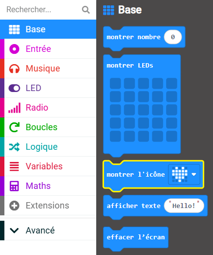

--- /task ---

--- task ---

Place-le sous le bloc `modifier mouvements`{:class='microbitvariables'}.

--- /task ---

--- task ---

Dans le menu `Base`{:class='microbitbasic'}, fais glisser un bloc `pause`{:class='microbitbasic'}.

Place-le sous le bloc `montrer l'icône`{:class='microbitbasic'}.

--- /task ---

--- task ---

Dans le menu `Base`{:class='microbitbasic'}, fais glisser un bloc `effacer l'écran`{:class='microbitbasic'}.

Place-le sous le bloc `pause`{:class='microbitbasic'}.

Ton code devrait ressembler à ceci :

```microbit
let mouvements = 0
basic.forever(function () {
    if (input.rotation(Rotation.Roll) < -10 || input.rotation(Rotation.Roll) > 10) {
        mouvements += 1
        basic.showIcon(IconNames.Heart)
        basic.pause(100)
        basic.clearScreen()
    }
})
```

--- /task ---

--- task ---

**Teste ton programme**

Lorsque tu modifies un bloc de code dans le panneau de l'éditeur de code, le simulateur redémarrera.

+ Déplace-toi à droite ou à gauche du micro:bit

Les LED s'allumeront et afficheront une icône en forme de cœur.

+ Éloigne-toi du micro:bit

Les LED continuent de clignoter jusqu'à ce que le micro:bit soit de nouveau à niveau.

--- /task ---

Ensuite, tu vas définir différentes positions de repos, car il est rare que quelqu'un dorme dans une position parfaitement horizontale toute la nuit !
