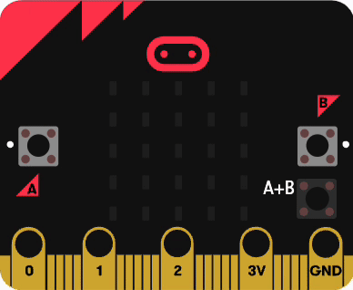
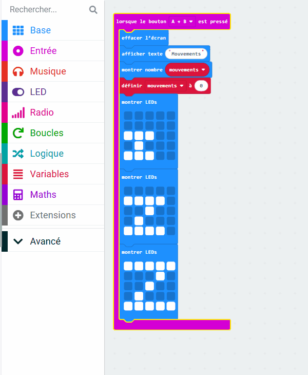

## Appuyer pour réinitialiser

<div style="display: flex; flex-wrap: wrap">
<div style="flex-basis: 200px; flex-grow: 1; margin-right: 15px;">
Il est temps d’améliorer encore ton tracker de sommeil ! 

Lorsque tu appuies simultanément sur les boutons A et B, le micro:bit indique le nombre de mouvements enregistrés et recommence à compter à partir de zéro. 

Tu feras également une animation spéciale de sommeil pour montrer que ton tracker de sommeil est prêt à t'aider à dormir !

</div>
<div>



</div>
</div>

Le micro:bit possède deux boutons, le bouton `A` et le bouton `B`.

Tu peux programmer quelque chose qui se produit lorsque tu appuies uniquement sur `A`, uniquement sur `B` ou lorsque tu appuies simultanément sur `A+B`.

### Afficher les mouvements totaux

--- task ---

Dans le menu `Entrée`{:class='microbitinput'}, fais glisser un bloc `lorsque le bouton`{:class='microbitinput'}.

Place-le dans le panneau de l'éditeur de code.


Utilise le menu déroulant pour changer le bouton en `A+B`{:class='microbitinput'}.

--- /task ---

Avant que le micro:bit n'affiche le nombre total de mouvements de sommeil enregistrés, tu devras effacer l'écran.

--- task ---

À partir du menu `Base`{:class='microbitbasic'}, fais glisser un bloc `effacer l'écran`{:class='microbitbasic'} et place-le à l'intérieur du bloc `lorsque le bouton`{:class='microbitinput'}.

Le bloc effacer l'écran éteint toutes les LED.

--- /task ---

Ensuite, tu veux voir le nombre total de mouvements de sommeil enregistrés par le micro:bit.

Avant d’afficher le nombre, c’est une bonne idée de montrer de quel nombre il s’agit.

--- task ---

Dans le menu `Base`{:class='microbitbasic'}, fais glisser un bloc `afficher texte`{:class='microbitbasic'}.

Place-le à l'intérieur du bloc `lorsque le bouton`{:class='microbitinput'}, sous le bloc `effacer l'écran`{:class='microbitbasic'}.

Remplace le mot `Hello` par `Mouvements`.

--- /task ---

Il est maintenant temps d’afficher le nombre total de mouvements de sommeil enregistrés.

--- task ---

Dans le menu `Base`{:class='microbitbasic'}, fais glisser un bloc `montrer nombre`{:class='microbitbasic'}.

Place-le à l'intérieur du bloc `lorsque le bouton`{:class='microbitinput'}, sous le bloc `afficher texte`{:class='microbitbasic'}.

--- /task ---

--- task ---

Dans le menu `Variables`{:class='microbitvariables'}, fais glisser le bloc `mouvements`{:class='microbitvariables'}.

Place-le sur le bloc `0` dans le bloc `montrer nombre`{:class='microbitbasic'}.

```microbit
input.onButtonPressed(Button.AB, function () {
    let mouvements = 0
    basic.clearScreen()
    basic.showString("Mouvements")
    basic.showNumber(mouvements)
})
```

--- /task ---

Tu dois maintenant réinitialiser la variable de mouvements à 0, prêt à suivre à nouveau.

--- task ---

Dans le menu `Variables`{:class='microbitvariables'}, fais glisser un bloc `définir`{:class='microbitvariables'}.

Place-le sous le bloc `montrer nombre`{:class='microbitbasic'}.

--- /task ---

--- task ---

Utilise le menu déroulant pour sélectionner `mouvements`{:class='microbitvariables'} comme variable à définir.

```microbit
let mouvements = 0
input.onButtonPressed(Button.AB, function () {
    basic.clearScreen()
    basic.showString("Mouvements")
    basic.showNumber(mouvements)
    mouvements = 0
})
```

--- /task ---

Pour montrer que le tracker de sommeil est prêt, tu peux afficher une animation. Comme il s'agit d'un outil de suivi du sommeil, tu vas créer une animation de quelques Z. 😴

--- task ---

Dans le menu `Base`{:class='microbitbasic'}, fais glisser **trois** blocs `montrer LEDs`{:class='microbitbasic'} et place-les sous le bloc `définir mouvements`{:class='microbitvariables'}.

Clique sur les carrés de chacun pour créer ces motifs :

```microbit
let mouvements = 0
input.onButtonPressed(Button.AB, function () {
    basic.clearScreen()
    basic.showString("Mouvements")
    basic.showNumber(mouvements)
    mouvements = 0
    basic.showLeds(`
        . . . . .
        . . . . .
        # # # . .
        . # . . .
        # # # . .
        `)
    basic.showLeds(`
        . . . . .
        # # # # .
        . . # . .
        . # . . .
        # # # # .
        `)
    basic.showLeds(`
        # # # # #
        . . . # .
        . . # . .
        . # . . .
        # # # # #
        `)
})
```

**Astuce :** si tu maintiens la souris enfoncée, tu peux sélectionner plusieurs LED au fur et à mesure de tes déplacements.

--- /task ---

Pour créer une animation, tu peux mettre les blocs "monter LEDs" dans une boucle.

--- task ---

Dans le menu `Boucles`{:class='microbitloops'}, fais glisser un bloc `répéter`{:class='microbitloops'} et place-le autour des blocs `montrer LEDs`{:class='microbitbasic'}.

Modifie le nombre de répétitions de `4` par `2`.



--- /task ---

Lorsque tu modifies un bloc de code dans le panneau de l'éditeur de code, le simulateur redémarrera.

--- task ---

**Test** Lorsque le programme s'exécute, déplace-toi sur la gauche et la droite du micro:bit pour enregistrer certains mouvements.

Ensuite, appuie sur le bouton `A+B`.

Le mot "Mouvements" défilera sur l’écran.

Le nombre de mouvements sera alors affiché.

L'animation zZ sera alors bouclée deux fois.


--- /task ---

Ensuite, tu vas utiliser les boutons `A` et `B` pour modifier la luminosité de l'écran !
