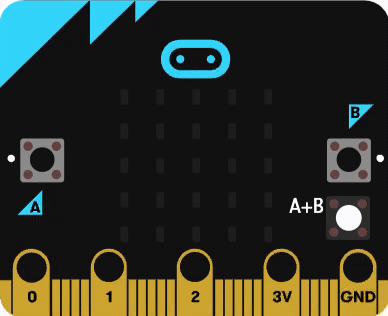
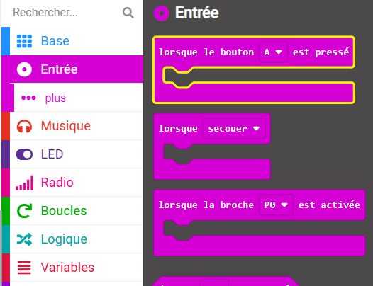
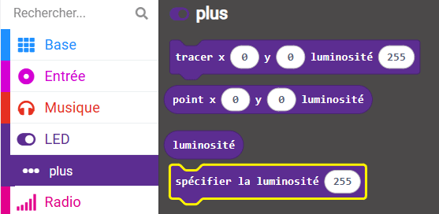

## Modifier la luminosité

<div style="display: flex; flex-wrap: wrap">
<div style="flex-basis: 200px; flex-grow: 1; margin-right: 15px;">

Quand il est tard dans la nuit, les LED sur ton micro:bit peuvent être trop lumineuses.

Dans cette étape, tu utiliseras les boutons A et B pour modifier la luminosité de l'écran LED du micro:bit.

<p style="border-left: solid; border-width:10px; border-color: #0faeb0; background-color: aliceblue; padding: 10px;">

Pour mieux dormir, essaie de ne pas être exposé à une lumière <span style="color: #0faeb0">trop vive</span> 2 heures avant le coucher. Si tu n'arrives pas à dormir, diminue l'intensité des lumières 2 heures avant de vouloir dormir. Et si tu te sens trop endormi·e le matin, va là où les lumières sont lumineuses pour te sentir plus éveillé·e
</p>

</div>
<div>



</div>
</div>

Comme le bouton A est à gauche, tu l'utiliseras pour baisser la luminosité.

### Réduire la luminosité

--- task ---

Dans le menu `Entrée`{:class='microbitinput'}, fais glisser un bloc `lorsque le bouton`{:class='microbitinput'}.

Place-le dans le panneau de l'éditeur de code.



--- /task ---

Chaque fois que tu appuies sur le bouton A, tu réduis la luminosité de moitié.

--- task ---

Dans le menu `LED...plus`{:class='microbitled'}, fais glisser un bloc `spécifier la luminosité`{:class='microbitled'}.



--- /task ---

--- task ---

Place-le à l'intérieur du bloc `lorsque le bouton`{:class='microbitinput'}.

**Débogage :** vérifie que tu as cliqué sur le menu LED **plus**, pas sur le menu LED normal.

--- /task ---

Pour diviser par deux la luminosité, tu utiliseras un bloc Math.

--- task ---

Dans le menu `Maths`{:class='microbitmath'}, fais glisser un bloc de division `0 / 0`{:class='microbitmath'}.

Place-le sur la valeur `255` dans le bloc `spécifier la luminosité`{:class='microbitled'}.

--- /task ---

--- task ---

Dans le menu `LED...plus`{:class='microbitled'}, fais glisser un bloc `luminosité`{:class='microbitled'}.

Place-le sur le premier bloc `0` dans le bloc `0 / 0`{:class='microbitmath'}.

--- /task ---

--- task ---

Remplace le deuxième `0` par `2`.

Cela définira la luminosité sur la valeur actuelle, divisée par 2.

Ton code devrait ressembler à ceci :

```microbit
input.onButtonPressed(Button.A, function () {
    led.setBrightness(led.brightness() / 2)
})
```

--- /task ---

### Augmenter la luminosité

Maintenant, tu vas configurer le bouton B pour augmenter la luminosité.

--- task ---

Fais un clic droit sur l'ensemble du bloc `lorsque le bouton A`{:class='microbitinput'} et clique sur **Reproduire**.

Il y aura maintenant deux blocs `lorsque le bouton A`{:class='microbitinput'} dans le panneau de l'éditeur de code.

--- /task ---

--- task ---

Clique sur la flèche à côté de `A`{:class='microbitinput'} sur le bloc dupliqué.

Choisis `B`{:class='microbitinput'}.

--- /task ---

--- task ---

Clique sur la flèche à côté de `/`{:class='microbitmath'} sur le bloc dupliqué.

Choisis `×`{:class='microbitmath'}.

--- /task ---

Tu auras maintenant ces blocs pour le bouton A et le bouton B :

```microbit
input.onButtonPressed(Button.A, function () {
    led.setBrightness(led.brightness() / 2)
})
input.onButtonPressed(Button.B, function () {
    led.setBrightness(led.brightness() * 2)
})
```

--- task ---

Lorsque tu modifies un bloc de code dans le panneau de l'éditeur de code, le simulateur redémarrera.

**Teste ton programme**

+ Clique sur le bouton `A` jusqu'à ce que les LED s'éteignent complètement

+ Clique sur le bouton `B` et vois ce qui se passe

Si tu as appuyé suffisamment de fois sur le bouton `A`, appuyer sur le bouton `B` ne rallumera pas les LED.

C'est parce que la valeur de luminosité a atteint `0`.

Lorsque tu multiplies `0` par `2` tu obtiens... `0`. Tu peux appuyer sur le bouton `B` autant de fois que tu veux, mais tu continueras à régler la luminosité sur `0 × 2`, soit **toujours** `0` !

--- /task ---

Tu dois empêcher que la valeur de luminosité soit définie sur `0`.

Pour cela, tu utiliseras un bloc logique pour réduire de moitié la valeur de luminosité seulement **si** le niveau de luminosité est **plus de 10**.

--- task ---

Dans le menu `Logique`{:class='microbitlogic'}, fais glisser un bloc `si`{:class='microbitlogic'}.

Place-le autour du bloc `spécifier la luminosité`{:class='microbitled'} dans le bloc `lorsque le bouton`{:class='microbitinput'}.

--- /task ---

--- task ---

Dans le menu `Logique`{:class='microbitlogic'}, fais glisser un bloc `0 < 0`{:class='microbitlogic'}

Place-le sur la partie `vrai`{:class='microbitlogic'}.

--- /task ---

--- task ---

Remplace le `<`{:class='microbitlogic'} par un `>`{:class='microbitlogic'}.

--- /task ---

--- task ---

Dans le menu `LED...plus`{:class='microbitled'}, fais glisser un bloc `luminosité`{:class='microbitled'}.

Place-le à l'intérieur du premier bloc `0` dans le `0 > 0`{:class='microbitlogic'}.

--- /task ---

--- task ---

Remplace le deuxième `0` par `10`.

--- /task ---

Voici une animation montrant les étapes ci-dessus :

{:width="350"}

Ton code devrait ressembler à ceci :

```microbit
input.onButtonPressed(Button.A, function () {
    if (led.brightness() > 10) {
        led.setBrightness(led.brightness() / 2)
    }
})
```

**Astuce :** il n'est pas nécessaire de faire cela pour le bloc `lorsque le bouton B` car la valeur de luminosité maximale sur laquelle les LED peuvent être réglées est `255`.

--- task ---

**Teste ton programme**

+ Déplace-toi sur les bords du micro:bit pour enregistrer et afficher certains mouvements

+ Appuie sur le bouton `A+B`

+ Appuie plusieurs fois sur le bouton `A`

L'affichage devrait être moins lumineux.

+ Appuie plusieurs fois sur le bouton `B`

L'écran devrait devenir plus lumineux.


--- /task ---

Ensuite, tu vas définir l’animation zZ d'endormissement pour qu’elle s’exécute au démarrage du programme et organiser ton code à l’aide d’une fonction !
