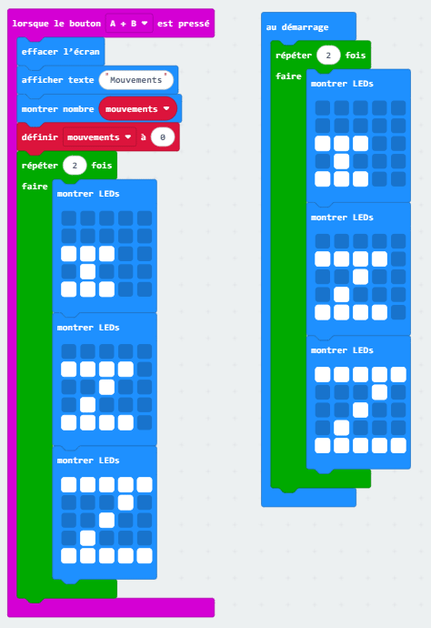
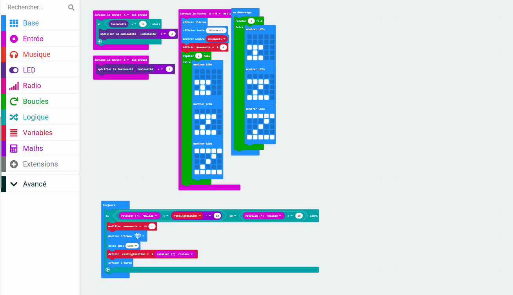

## Afficher quelques Z

<div style="display: flex; flex-wrap: wrap">
<div style="flex-basis: 200px; flex-grow: 1; margin-right: 15px;">

Lorsque le programme démarre, il est bon de savoir qu'il est prêt à commencer le suivi.

Dans cette étape, tu afficheras à nouveau l'animation zZ au démarrage du programme et utiliseras une fonction pour organiser ton code.

</div>
</div>

### Réutiliser le code

Tu peux réutiliser le code d'animation.

--- task ---

Fais un clic droit sur le bloc `répéter`{:class='microbitloops'} et clique sur **Reproduire**.

--- /task ---

Il y aura maintenant deux blocs `répéter`{:class='microbitloops'} dans le panneau de l'éditeur de code. Chacun contiendra trois blocs `montrer LEDs`{:class='microbitbasic'}.

--- task ---

Place le bloc `répéter`{:class='microbitloops'} dans le bloc `au démarrage`{:class='microbitbasic'}.



--- /task ---

### Organiser avec une fonction

L'animation est un grand groupe de blocs de code.

La répétition d’un grand groupe de blocs rend notre code désordonné.

Si tu dois réutiliser du code, il est parfois préférable de le placer dans une fonction, puis d'« appeler » la fonction pour l'exécuter.

<p style="border-left: solid; border-width:10px; border-color: #0faeb0; background-color: aliceblue; padding: 10px;">

Une <span style="color: #0faeb0">fonction</span> est un groupe de blocs que tu peux créer et nommer. Tu peux exécuter ces blocs en « appelant » le nom de la fonction. Un autre mot pour une fonction est un <span style="color: #0faeb0">sous-programme</span>, car il peut être appelé pour s'exécuter à partir du programme principal.
</p>

--- task ---

Clique sur le menu `Avancé` pour afficher le menu Fonctions.

Clique sur le menu **Fonctions** puis clique sur **Créer une fonction**.

Nomme la fonction `zZ`.



--- /task ---

--- task ---

Dans le bloc `lorsque le bouton A+B`{:class='microbitinput'}, fais glisser le bloc `répéter`{:class='microbitloops'}.

Place-le à l'intérieur de ton nouveau bloc `fonction zZ`{:class='microbitfunctions'}.

--- /task ---

--- task ---

Supprime le code à l'intérieur du bloc `au démarrage`{:class='microbitbasic'}.

--- /task ---

Lorsqu'un bloc `appel zZ`{:class='microbitfunctions'} est exécuté, il exécute le code dans la fonction `zZ`{:class='microbitfunctions'}.

--- task ---

Dans le menu Avancé > Fonctions, fais glisser un bloc `appel zZ`{:class='microbitfunctions'}.

Place-le à l'intérieur du bloc `au démarrage`{:class='microbitbasic'}.

--- /task ---

--- task ---

Fais glisser un autre bloc `appel zZ`{:class='microbitfunctions'}.

Place-le à l'intérieur du bloc `lorsque le bouton A+B`{:class='microbitinput'}, sous le bloc `définir mouvements`{:class='microbitvariables'}.

--- /task ---

Voici les blocs qui ont changé à cette étape :

```microbit
function zZ () {
    for (let index = 0; index < 2; index++) {
        basic.showLeds(`
            . . . . .
            . . . . .
            # # # . .
            . # . . .
            # # # . .
            `)
        basic.showLeds(`
            . . . . .
            # # # # .
            . . # . .
            . # . . .
            # # # # .
            `)
        basic.showLeds(`
            # # # # #
            . . . # .
            . . # . .
            . # . . .
            # # # # #
            `)
    }
}
input.onButtonPressed(Button.AB, function () {
    basic.clearScreen()
    basic.showString("Movements")
    basic.showNumber(movements)
    movements = 0
    zZ()
})
let movements = 0
zZ()
```

--- task ---

**Teste ton programme**

+ Vérifie que ton animation zZ est jouée au démarrage du simulateur
+ Vérifie que ton animation zZ est également jouée lorsque le bouton `A+B` est pressé (après l'affichage du nombre de mouvements)

--- /task ---

Tu as maintenant une fonction, tu peux y ajouter des éléments et le code s'exécutera à chaque fois qu'il sera appelé !

Ensuite, tu ajouteras un compte à rebours à ta fonction.