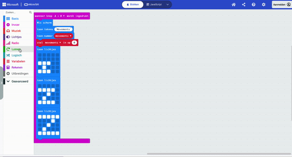

## Druk om te resetten

<div style="display: flex; flex-wrap: wrap">
<div style="flex-basis: 200px; flex-grow: 1; margin-right: 15px;">
Het is tijd om je slaapmonitor nog beter te maken! 

Wanneer je de A- en B-knop tegelijk indrukt, laat de micro:bit zien hoeveel bewegingen er zijn geregistreerd en begint vervolgens weer vanaf nul te tellen. 

Je gaat ook een speciale slaapanimatie maken om te laten zien dat je slaapmonitor helemaal klaar is om je te helpen slapen!

</div>
<div>


</div>
</div>

De micro:bit heeft twee knoppen, de `A` knop en de `B` knop.

Je kunt iets programmeren als alleen `A` wordt ingedrukt, alleen `B` wordt ingedrukt, of wanneer `A+B` samen worden ingedrukt.

### Toon het totaal aantal bewegingen

--- task ---

Sleep vanuit het menu `Invoer`{:class='microbitinput'} een `wanneer knop wordt ingedrukt`{:class='microbitinput'} blok.

Plaats het in het bewerkingspaneel.


Gebruik het vervolgkeuzemenu om de knop te wijzigen in `A+B`{:class='microbitinput'}.

--- /task ---

Voordat de micro:bit het totaal aantal geregistreerde slaapbewegingen weergeeft, moet je het scherm wissen.

--- task ---

In het `Basis`{:class="microbitbasic"} menu, sleep het blok `Wis scherm`{:class="microbitbasic"} in het `wanneer knop wordt ingedrukt`{:class="microbitlogic"} blok.

Het Wis scherm blok schakelt alle LED's uit.

--- /task ---

Vervolgens wil je het totale aantal slaapbewegingen zien dat de micro:bit heeft geregistreerd.

Voordat je het nummer weergeeft, is het een goed idee om te laten zien wat het getal weergeeft.

--- task ---

Sleep vanuit het menu `Basis`{:class="microbitbasic"} het blok `toon tekens`{:class="microbitbasic"}.

Plaats het in het `wanneer knop wordt ingedrukt`{:class='microbitinput'} blok, onder het `wis scherm`{:class='microbitbasic'} blok.

Vervang het woord `Hello` door `Bewegingen`.

--- /task ---

Nu is het tijd om het totale aantal geregistreerde slaapbewegingen weer te geven.

--- task ---

Sleep vanuit het menu `Basis`{:class="microbitbasic"} het blok `toon nummer`{:class="microbitbasic"}.

Plaats het in het `wanneer knop wordt ingedrukt`{:class='microbitinput'} blok, onder het `toon tekens`{:class='microbitbasic'} blok.

--- /task ---

--- task ---

Vanuit het menu `Variabelen`{:class='microbitvariables'} sleep je het blokje `bewegingen`{:class='microbitvariables'}.

Plaats het op de `0` in blok `toon nummer`{:class='microbitbasic'}.

```microbit
input.onButtonPressed(Button.AB, function () {
    let bewegingen = 0
    basic.clearScreen()
    basic.showString("Bewegingen")
    basic.showNumber(bewegingen)
})
```

--- /task ---

Je moet nu de bewegingsvariabele opnieuw instellen op 0, zodat je opnieuw bewegingen kunt registeren.

--- task ---

Sleep vanuit het menu `Variabelen`{:class="microbitvariables"} een blok `stel in op`{:class="microbitvariables"}.

Plaats het onder het blok `toon nummer`{:class='microbitbasic'}.

--- /task ---

--- task ---

Gebruik het vervolgkeuzemenu om `bewegingen`{:class='microbitvariables'} te selecteren als de in te stellen variabele.

```microbit
let bewegingen = 0
input.onButtonPressed(Button.AB, function () {
    basic.clearScreen()
    basic.showString("Bewegingen")
    basic.showNumber(bewegingen)
    bewegingen = 0
})
```

--- /task ---

Om te laten zien dat de slaapmonitor klaar is, kun je een animatie laten zien. Aangezien dit een slaapmonitor is, maak je een animatie van enkele Z's. 😴

--- task ---

Van het `Basis`{:class='microbitbasic'} menu, sleep **drie** `toon lichtjes`{:class='microbitbasic'} blokken en plaats ze onder het `stel bewegingen in op`{:class='microbitvariables'} blok.

Klik op de vierkantjes om deze patronen te maken:

```microbit
let bewegingen = 0
input.onButtonPressed(Button.AB, function () {
    basic.clearScreen()
    basic.showString("Bewegingen")
    basic.showNumber(bewegingen)
    bewegingen = 0
    basic.showLeds(`
        . . . . .
        . . . . .
        # # # . .
        . # . . .
        # # # . .
        `)
    basic.showLeds(`
        . . . . .
        # # # # .
        . . # . .
        . # . . .
        # # # # .
        `)
    basic.showLeds(`
        # # # # #
        . . . # .
        . . # . .
        . # . . .
        # # # # #
        `)
})
```

**Tip:** Als je de muis ingedrukt houdt kun je meerdere LED's selecteren.

--- /task ---

Om een animatie te maken, kun je de 'toon lichtjes' blokken in een lus plaatsen.

--- task ---

Sleep vanuit het menu `Lussen`{:class='microbitloops'} een blok met `4 keer herhalen doe`{:class='microbitloops'} en plaats het rond de drie `toon lichtjes`{:class='microbitbasic'} blokken.

Wijzig het aantal herhalingen van `4` in `2`.



--- /task ---

Als je een wijziging aanbrengt in een codeblok in het bewerkingspaneel zal de simulator opnieuw starten.

--- task ---

**Test** Wanneer het programma draait, beweeg je over de linker- en rechterkant van de micro:bit om enkele bewegingen vast te leggen.

Druk vervolgens op de knop `A+B`.

Het woord 'Bewegingen' scrollt over het display.

Vervolgens wordt het aantal bewegingen weergegeven.

De zZ-animatie wordt dan twee keer herhaald.


--- /task ---

Vervolgens ga je de `A` knop en `B` knop gebruiken om de helderheid van het display te wijzigen!
