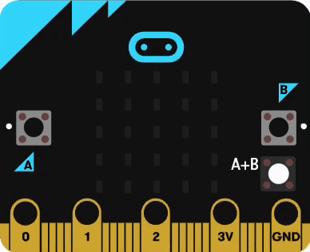
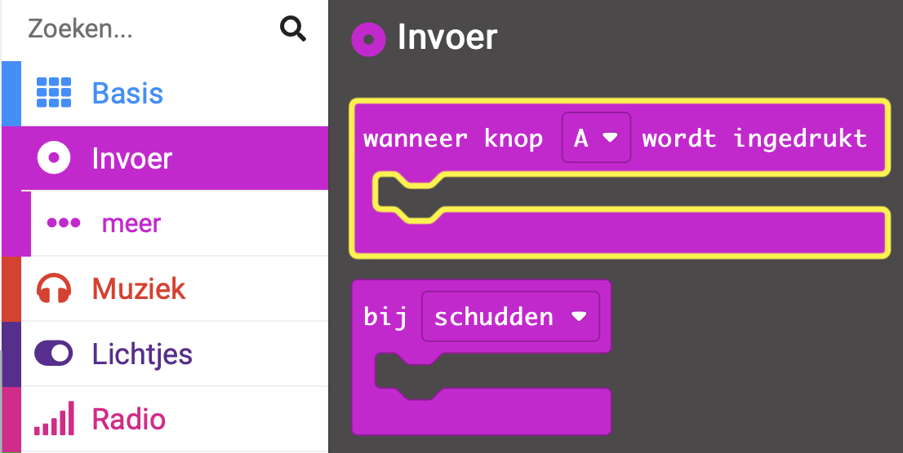
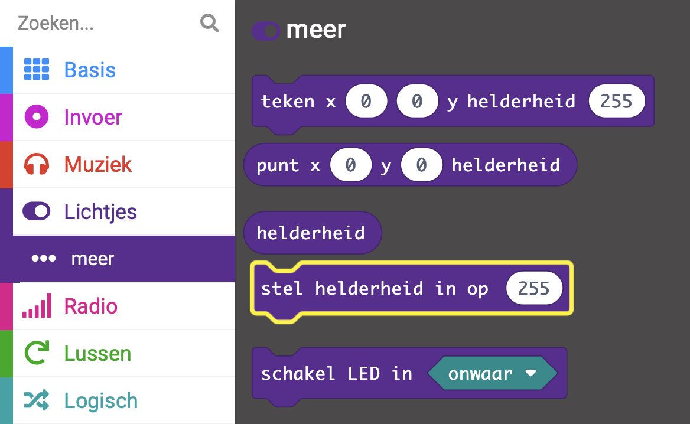

## Verander de helderheid

<div style="display: flex; flex-wrap: wrap">
<div style="flex-basis: 200px; flex-grow: 1; margin-right: 15px;">

Als laat op de avond is, kunnen de LED's op je micro:bit te helder zijn.

In deze stap gebruik je de A knop en B knop om de helderheid van het LED display van de micro:bit te veranderen.

<p style="border-left: solid; border-width:10px; border-color: #0faeb0; background-color: aliceblue; padding: 10px;">

Om beter te slapen, probeer <span style="color: #0faeb0">fel licht</span> vanaf 2 uur voor bedtijd te vermijden. Als je niet kunt slapen, zorg er dan voor dat de lichten 2 uur voordat je wilt gaan slapen minder fel zijn. En als je je 's ochtends te slaperig voelt, ga dan naar een helder verlichte plek, zodat je je wakkerder voelt.
</p>

</div>
<div>



</div>
</div>

Omdat de A-knop aan de linkerkant zit, gebruik je deze om de helderheid te verlagen.

### Verlaag de helderheid

--- task ---

Sleep vanuit het menu `Invoer`{:class='microbitinput'} een `wanneer knop wordt ingedrukt`{:class='microbitinput'} blok.

Plaats het in het bewerkingspaneel.



--- /task ---

Elke keer als de A knop wordt ingedrukt, halveert de helderheid.

--- task ---

Sleep vanuit het menu `Lichtjes...meer`{:class='microbitinput'} een `stel helderheid in op `{:class='microbitinput'} blok.



--- /task ---

--- task ---

Plaats het in het `wanneer knop wordt ingedrukt `{:class='microbitinput'} blok.

**Foutopsporing:** Controleer of je hebt geklikt op het Lichtjes **meer** menu, en niet op het normale Lichtjes menu.

--- /task ---

Om de helderheid te halveren, gebruik je een Rekenen blok.

--- task ---

Sleep vanuit het menu `Rekenen`{:class="microbitmath"} een `0 / 0`{:class="microbitmath"} deel blok.

Plaats het op de `255` in het blok `stel helderheid in op`{:class='microbitbasic'}.

--- /task ---

--- task ---

Sleep vanuit het menu `Lichtjes...meer`{:class='microbitinput'} een `helderheid`{:class='microbitinput'} blok.

Plaats het in de eerste `0` in het `0 / 0`{:class="microbitmath"} blok.

--- /task ---

--- task ---

Verander de tweede `0` in `2`.

Hierdoor wordt de helderheid ingesteld op de huidige waarde, gedeeld door 2.

Je code zou er als volgt uit moeten zien:

```microbit
input.onButtonPressed(Button.A, function () {
    led.setBrightness(led.brightness() / 2)
})
```

--- /task ---

### Verhoog de helderheid

Nu ga je de B-knop instellen om de helderheid te verhogen.

--- task ---

Klik met de rechtermuisknop op het volledige `wanneer knop A wordt ingedrukt`{:class='microbitinput'} blok en klik **Dupliceren**.

Er zullen nu twee `wanneer knop A wordt ingedrukt`{:class='microbitinput'} blokken in het bewerkingspaneel staan.

--- /task ---

--- task ---

Klik op de pijl naast `A`{:class='microbitinput'} op het gedupliceerde blok.

Kies `B`{:class='microbitinput'}.

--- /task ---

--- task ---

Klik op de pijl naast `/`{:class='microbitmath'} op het gedupliceerde blok.

Kies `×`{:class='microbitmath'}.

--- /task ---

Je hebt nu deze blokken voor de A-knop en de B-knop:

```microbit
input.onButtonPressed(Button.A, function () {
    led.setBrightness(led.brightness() / 2)
})
input.onButtonPressed(Button.B, function () {
    led.setBrightness(led.brightness() * 2)
})
```

--- task ---

Als je een wijziging aanbrengt in een codeblok in het bewerkingspaneel zal de simulator opnieuw starten.

**Test je programma**

+ Klik op de `A` knop totdat de LED's volledig uit gaan

+ Klik op de knop `B` en kijk wat er gebeurt

Als je de `A` knop genoeg hebt ingedrukt, zal het indrukken van de `B` knop de LEDs niet meer aanzetten.

Dit komt omdat de helderheidswaarde `0` is bereikt.

Wanneer je `0` vermenigvuldigt met `2` krijg je... `0`. Je kunt de `B` knop zo vaak indrukken als je wilt, maar je blijft de helderheid instellen op `0 × 2`, wat **altijd** `0` is!

--- /task ---

Je moet voorkomen dat de helderheidswaarde wordt ingesteld op `0`.

Om dit te doen gebruik je een Logisch blok om de helderheidswaarde alleen te halveren **als** het helderheidsniveau **meer dan 10** is.

--- task ---

Vanuit het `Logisch`{:class="microbitlogic"} menu, sleep een `als`{:class="microbitlogic"} blok.

Plaats het rond het blok `stel helderheid in op`{:class='microbitled'} in het blok `wanneer knop A wordt ingedrukt`{:class='microbitinput'}.

--- /task ---

--- task ---

Vanuit het `Logisch`{:class="microbitlogic"} menu, sleep een `0 < 0`{:class="microbitlogic"} blok

Plaats het op het `waar`{:class='microbitlogic'} gedeelte.

--- /task ---

--- task ---

Verander de `<`{:class='microbitlogic'} in een `>`{:class='microbitlogic'}.

--- /task ---

--- task ---

Sleep vanuit het menu `Lichtjes...meer`{:class='microbitinput'} een `helderheid`{:class='microbitinput'} blok.

Plaats het in de eerste `0` in het `0 > 0`{:class="microbitlogic"} blok.

--- /task ---

--- task ---

Verander de tweede `0` in `10`.

--- /task ---

Hier is een animatie die de bovenstaande stappen laat zien:

 Een '0 > 0' blok wordt vervolgens uit het Logisch menu gehaald en geplaatst in de eerste '0' van het '0 > 0' blok. Een 'helderheid' blok wordt vervolgens gehaald van het 'Lichtjes... meer' menu en geplaatst in het eerste '0' van het '0 > 0' blok. The second '0' is changed to '10'." width="350"/>

Je code zou er als volgt uit moeten zien:

```microbit
input.onButtonPressed(Button.A, function () {
    if (led.brightness() > 10) {
        led.setBrightness(led.brightness() / 2)
    }
})
```

**Tip:** Het is niet nodig om dit te doen voor het `wanneer knop B wordt ingedrukt` blok omdat de maximale helderheid waarde waarop de LED's kunnen worden ingesteld `255` is.

--- task ---

**Test je programma**

+ Beweeg over de randen van de micro:bit om enkele bewegingen vast te leggen en weer te geven

+ Druk op de knop `A+B`

+ Druk een paar keer op de `A` knop

Het display zou minder helder moeten worden.

+ Druk een paar keer op de knop `B`

Het display zou helderder moeten worden.


--- /task ---

Vervolgens ga je instellen dat de slaperige zZ-animatie wordt uitgevoerd wanneer het programma start en organiseer je je code met behulp van een functie!
