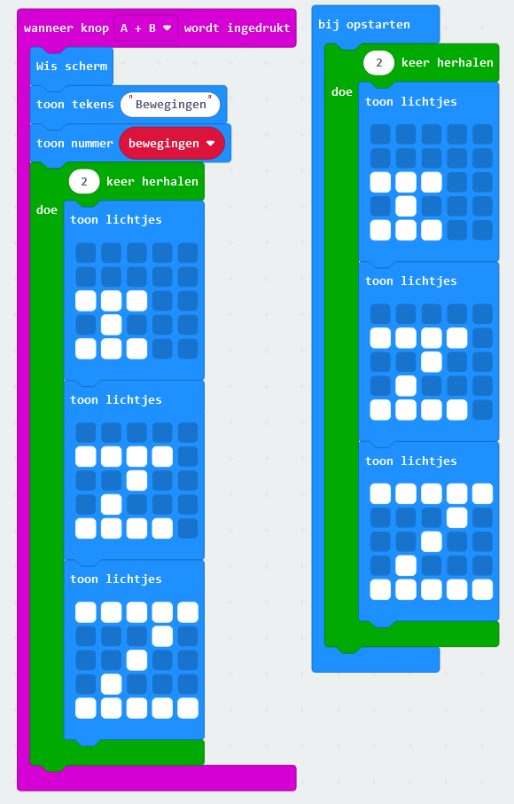
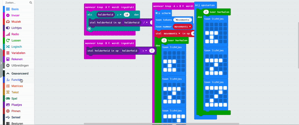

## Laat enkele Z's zien

<div style="display: flex; flex-wrap: wrap">
<div style="flex-basis: 200px; flex-grow: 1; margin-right: 15px;">

Wanneer het programma start, is het goed om te weten dat het klaar is om te beginnen met monitoren.

In deze stap zal je de zZs-animatie opnieuw weergeven wanneer het programma start en een functie gebruiken om je code te organiseren.

</div>
</div>

### Code hergebruiken

Je kunt de animatiecode hergebruiken.

--- task ---

Klik met de rechtermuisknop op het blok `keer herhalen`{:class='microbitloops'} en klik op **Dupliceren**.

--- /task ---

Er zullen nu twee `keer herhalen`{:class='microbitloops'} blokken in het bewerkingspaneel staan. Elk blok bevat drie `toon lichtjes`{:class='microbitbasic'} blokken.

--- task ---

Plaats het gedupliceerde `keer herhalen`{:class='microbitloops'} blok binnen het `bij opstarten`{:class='microbitbasic'} blok.



--- /task ---

### Maak je code netjes met een functie

De animatie is een grote groep codeblokken.

Het herhalen van een grote groep blokken maakt onze code rommelig.

Als je code opnieuw moet gebruiken, is het soms beter om deze in een functie te zetten en vervolgens de functie 'aan te roepen'.

<p style="border-left: solid; border-width:10px; border-color: #0faeb0; background-color: aliceblue; padding: 10px;">

Een <span style="color: #0faeb0">functie</span> is een groep blokken die je kunt maken en een naam kunt geven. Je kunt deze blokken uitvoeren door de naam van de functie 'aan te roepen'. Een ander woord voor een functie is een <span style="color: #0faeb0">subprogramma</span>, omdat het kan worden uitgevoerd vanuit het hoofdprogramma.
</p>

--- task ---

Klik op het menu `Geavanceerd` om het menu Functies weer te geven.

Klik op het menu **Functies** en klik vervolgens op **Maak een functie**.

Noem de functie `zZ`.



--- /task ---

--- task ---

Vanaf het `wanneer knop A+B wordt ingedrukt`{:class='microbitinput'} blok, sleep je het `keer herhalen`{:class='microbitloops'} blok.

Plaats het in je nieuwe `functie zZ`{:class='microbitfunctions'} blok.

--- /task ---

--- task ---

Verwijder de code in het `bij opstarten`{:class='microbitbasic'} blok.

--- /task ---

Wanneer een `aanroep zZ`{:class='microbitfunctions'} blok wordt uitgevoerd, voert het de code uit in de `functie zZ`{:class='microbitfunctions'}.

--- task ---

Vanuit het Geavanceerde > Functies menu sleep je een `aanroep zZ`{:class='microbitfunctions'} blok.

Plaats het in het `bij opstarten`{:class='microbitbasic'} blok.

--- /task ---

--- task ---

Sleep nog een `aanroep zZ`{:class='microbitfunctions'} blok.

Plaats het in de `wanneer knop A+B wordt ingedrukt`{:class='microbitinput'} blok, onder het `stel bewegingen in op`{:class='microbitvariables'} blok.

--- /task ---

Dit zijn de blokken die in deze stap zijn gewijzigd:

```microbit
function zZ () {
    for (let index = 0; index < 2; index++) {
        basic.showLeds(`
            . . . . .
            . . . . .
            # # # . .
            . # . . .
            # # # . .
            `)
        basic.showLeds(`
            . . . . .
            # # # # .
            . . # . .
            . # . . .
            # # # # .
            `)
        basic.showLeds(`
            # # # # #
            . . . # .
            . . # . .
            . # . . .
            # # # # #
            `)
    }
}
input.onButtonPressed(Button.AB, function () {
    basic.clearScreen()
    basic.showString("Bewegingen")
    basic.showNumber(bewegingen)
    bewegingen = 0
    zZ()
})
let bewegingen = 0
zZ()
```

--- task ---

**Test je programma**

+ Controleer of je zZ animatie afspeelt wanneer de simulator start
+ Controleer of je zZ animatie ook speelt wanneer de `A+B` knop wordt ingedrukt (nadat het aantal bewegingen is weergegeven)

--- /task ---

Nu je een functie hebt, kun je er dingen aan toevoegen en de code wordt uitgevoerd elke keer dat deze wordt aangeroepen!

Vervolgens voeg je een afteltimer toe aan de functie.